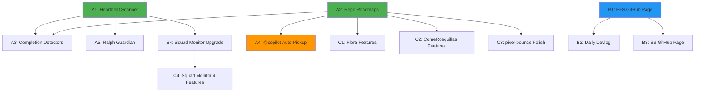

# Phase 2 Visibility & Autonomy — Consolidated Execution Plan

**Prepared by:** Morpheus (Lead/Architect)  
**Date:** 2026-03-16  
**Status:** APPROVED FOR EXECUTION  
**Cost:** €0 (100% GitHub free tier)

---

## Executive Summary

This plan consolidates three parallel workstreams that will transform Syntax Sorcery from a technically-complete pipeline into a fully autonomous, publicly visible software company. All 6 repositories (SS, FFS, Flora, ComeRosquillas, pixel-bounce, ffs-squad-monitor) evolve simultaneously.

**Key Constraints:**
- €0 total cost (GitHub free tier only)
- All issues must be @copilot-ready (specific, actionable)
- Parallel execution across all repos
- Daily devlog (not weekly)
- Squad Monitor: 60s polling (NO streaming, NO Azure)

**Timeline:** 2 weeks for core visibility, 4 weeks for full autonomy

**Dependencies:** See graph at end of document

---

## WORKSTREAM A: AUTONOMY (Repos Evolve Alone)

Goal: Enable all 6 repos to self-govern with <15min/week human intervention.

### A1. Repository Heartbeat Scanner

**Issue Title:** Implement squad-heartbeat.yml scanner for all 6 repos  
**Repo:** Syntax Sorcery  
**Assigned to:** Tank (Cloud Engineer)  
**Dependencies:** None (can start immediately)  
**Labels:** `squad:tank`, `pipeline:orchestration`, `type:automation`

**Acceptance Criteria:**
- [ ] `.github/workflows/squad-heartbeat.yml` created in Syntax Sorcery root
- [ ] Cron schedule: Daily at 00:00 UTC (not weekly — team works 24x7)
- [ ] Scans all 6 repos: SS, FFS, Flora, ComeRosquillas, pixel-bounce, ffs-squad-monitor
- [ ] Checks: pipeline:* label states, open issues, build status, last deploy timestamp
- [ ] Outputs JSON summary to `.squad/heartbeat/YYYY-MM-DD.json`
- [ ] Triggers completion detectors (see A3) for each repo
- [ ] Test: Manual workflow dispatch completes successfully in <2min

**Implementation Notes:**
- Use GitHub CLI (`gh api`) to query repo states
- No external APIs or Azure dependencies
- Store last 30 days of heartbeat data for trend analysis

---

### A2. Per-Repo Roadmap Files

**Issue Title:** Create roadmap.md files defining next work for each repo  
**Repo:** Syntax Sorcery (creates for all downstream)  
**Assigned to:** Oracle (Product & Docs)  
**Dependencies:** None (can start immediately)  
**Labels:** `squad:oracle`, `type:documentation`, `priority:high`

**Acceptance Criteria:**
- [ ] `roadmap.md` created in each of 6 repos' root directories
- [ ] Each roadmap contains:
  - Current status (what's deployed/working)
  - Next 3 priority features (ordered)
  - Completion criteria (how to know when done)
  - @copilot-ready issue titles for each feature
- [ ] Roadmaps reviewed by Morpheus for architectural alignment
- [ ] Committed to main branch of each repo

**Roadmap Targets:**
- **SS:** Monitoring, upstream governance automation
- **FFS:** Hub page, devlog automation, game discovery
- **Flora:** Feature completion (see C1)
- **ComeRosquillas:** Feature completion (see C2)
- **pixel-bounce:** Polish & roadmap (see C3)
- **ffs-squad-monitor:** 4 new features (see C4)

---

### A3. Completion Detectors (Game/Feature Done Logic)

**Issue Title:** Implement completion detection logic for games and features  
**Repo:** Syntax Sorcery  
**Assigned to:** Switch (Tester/QA)  
**Dependencies:** A1 (needs heartbeat data)  
**Labels:** `squad:switch`, `type:automation`, `pipeline:quality`

**Acceptance Criteria:**
- [ ] Script: `.squad/scripts/detect-completion.js` created
- [ ] Called by squad-heartbeat.yml after scanning
- [ ] Game completion logic:
  - `pipeline:deployed` label present
  - GitHub Pages accessible (HTTP 200)
  - No P0/P1 bugs open
  - 24h stability (no failed deploys)
- [ ] Feature completion logic:
  - Issue closed with label `status:verified`
  - All sub-tasks checked off
  - Tests passing in last 3 CI runs
- [ ] On completion: Creates "Next Work" issue from roadmap.md
- [ ] Test: Simulated completion triggers next issue correctly

**Implementation Notes:**
- Use GitHub CLI for issue/label queries
- Completion triggers roadmap advancement (A2 integration)
- Logs all completion events to `.squad/heartbeat/completions.json`

---

### A4. @copilot Auto-Pickup Integration

**Issue Title:** Configure @copilot auto-assignment for well-defined issues  
**Repo:** Syntax Sorcery (config applies to all repos)  
**Assigned to:** Morpheus (Lead/Architect)  
**Dependencies:** A2 (needs roadmaps to generate issues)  
**Labels:** `squad:morpheus`, `type:automation`, `priority:high`

**Acceptance Criteria:**
- [ ] Issue template `.github/ISSUE_TEMPLATE/copilot-ready.md` created
- [ ] Template includes required sections:
  - Clear title (action verb + noun)
  - Acceptance criteria checklist
  - Files to modify (specific paths)
  - Example code or structure
- [ ] squad-issue-assign.yml updated to detect `copilot-ready` label
- [ ] @copilot assigned immediately when label applied
- [ ] Test: Create 3 sample issues, verify auto-assignment in <1min
- [ ] Document @copilot best practices in `.squad/guides/copilot-issues.md`

**Quality Gates:**
- Issues without clear acceptance criteria → manual assignment only
- Issues affecting architecture (T1) → Morpheus review first
- Issues with external dependencies → blocked, not assigned

---

### A5. Ralph Guardian Mode (Escalation Logic)

**Issue Title:** Enhance Ralph v5 with guardian escalation for stuck work  
**Repo:** Syntax Sorcery  
**Assigned to:** Tank (Cloud Engineer)  
**Dependencies:** A1 (needs heartbeat monitoring)  
**Labels:** `squad:tank`, `type:automation`, `priority:medium`

**Acceptance Criteria:**
- [ ] Ralph workflow updated: `.github/workflows/squad-monitor.yml`
- [ ] Detects stuck states:
  - Issue open >72h with no activity
  - Build failing >3 consecutive runs
  - Deploy blocked >24h
  - Pipeline label unchanged >5 days
- [ ] Escalation actions:
  - Post issue comment tagging assigned agent
  - Label with `status:blocked` or `status:needs-help`
  - Create summary in `.squad/escalations/YYYY-MM-DD.md`
  - Notify via GitHub Discussions post
- [ ] Test: Simulate stuck issue, verify escalation fires correctly
- [ ] Non-intrusive: No alerts outside GitHub, no emails

---

## WORKSTREAM B: VISIBILITY (Show the World)

Goal: Public-facing sites showcasing games, team, and daily progress.

### B1. FFS GitHub Page (Game Hub)

**Issue Title:** Build FFS GitHub Page with playable game embeds and auto-updates  
**Repo:** FFS (FirstFrameStudios)  
**Assigned to:** Trinity (Full-Stack Developer)  
**Dependencies:** None (can start immediately)  
**Labels:** `squad:trinity`, `type:feature`, `priority:critical`

**Acceptance Criteria:**
- [ ] Astro SSG site deployed to https://[org].github.io/FFS/
- [ ] Homepage sections:
  - Hero: "FirstFrame Studios — AI-Powered Game Development"
  - Game Grid: Cards for Flora, ComeRosquillas, pixel-bounce (embed iframes)
  - Each card: thumbnail, title, "Play Now" button, GitHub link
  - Auto-update: Cron job fetches game list from downstream repos
- [ ] Iframes load games directly from GitHub Pages URLs
- [ ] Responsive design (mobile + desktop)
- [ ] Build time <30s, deploy automated via GitHub Actions
- [ ] Test: All 3 games playable in iframes, no CORS errors
- [ ] Lighthouse score: Performance >90, Accessibility >90

**Technical Specs:**
- Framework: Astro 4.x (static site generation)
- Styling: Tailwind CSS
- Game embeds: iframe with sandbox attributes
- Auto-update: `.github/workflows/update-games.yml` (daily cron)

---

### B2. Daily Devlog (Auto-Generated Within FFS Page)

**Issue Title:** Implement daily auto-generated devlog within FFS GitHub Page  
**Repo:** FFS (FirstFrameStudios)  
**Assigned to:** Oracle (Product & Docs)  
**Dependencies:** B1 (FFS page must exist)  
**Labels:** `squad:oracle`, `type:feature`, `priority:high`

**Acceptance Criteria:**
- [ ] Devlog route: `/devlog` on FFS GitHub Page
- [ ] Auto-generated DAILY (not weekly) at 02:00 UTC
- [ ] Data sources:
  - `.squad/decisions.md` from all 6 repos
  - Closed issues (last 24h) with labels `pipeline:*`
  - Deploy events from GitHub Pages
  - PR merges affecting main branch
- [ ] Format: Chronological feed with timestamps, grouped by repo
- [ ] Each entry: date, repo, event type, summary (1-2 sentences)
- [ ] No manual writing required — 100% automated
- [ ] Test: Generate devlog for last 7 days, verify all events captured

**Content Template:**
```
## 2026-03-16 (Day N of autonomy)
- **pixel-bounce**: Deployed v1.2.3 with physics improvements
- **FFS**: Merged PR #42 (devlog automation)
- **Syntax Sorcery**: Decision approved — Phase 2 plan execution begins
```

---

### B3. Syntax Sorcery GitHub Page (Company Showcase)

**Issue Title:** Build SS GitHub Page showing constellation and system health  
**Repo:** Syntax Sorcery  
**Assigned to:** Trinity (Full-Stack Developer)  
**Dependencies:** B1 (for linking to FFS)  
**Labels:** `squad:trinity`, `type:feature`, `priority:high`

**Acceptance Criteria:**
- [ ] Astro SSG site deployed to https://[org].github.io/Syntax-Sorcery/
- [ ] Homepage sections:
  - Hero: "Syntax Sorcery — Autonomous Software Company"
  - Downstream Companies: FFS card (logo, link, status badge)
  - Recent Activity: Last 5 decisions from `.squad/decisions.md`
  - Team Roster: 8 agents with avatars and roles
  - System Health: Pipeline success rate, deploy count, uptime %
- [ ] Auto-update: Daily cron fetches data from all repos
- [ ] Links to FFS page, squad-monitor dashboard, GitHub org
- [ ] Test: All links functional, status badges reflect real data
- [ ] Lighthouse score: Performance >90, Accessibility >90

**Design Principles:**
- Professional, not playful (corporate showcase)
- Data visualization: health metrics in charts (Chart.js)
- Mobile-first responsive design

---

### B4. Squad Monitor Dashboard Upgrade (Polling Mode)

**Issue Title:** Upgrade ffs-squad-monitor to 60s polling mode with 4 new features  
**Repo:** ffs-squad-monitor  
**Assigned to:** Trinity (Full-Stack Developer)  
**Dependencies:** A1 (needs heartbeat data)  
**Labels:** `squad:trinity`, `type:enhancement`, `priority:medium`

**Acceptance Criteria:**
- [ ] Dashboard deployed to GitHub Pages (NOT Azure ACI)
- [ ] Polling interval: 60 seconds (fetch data via GitHub API)
- [ ] Data source: `.squad/heartbeat/*.json` from SS repo
- [ ] 4 new features implemented (see C4 for details):
  1. Activity Feed (last 50 events, real-time)
  2. Pipeline Visualizer (6 stages, all repos)
  3. Team Board (agent status, assigned work)
  4. Cost Tracker (always €0, shows savings vs. alternatives)
- [ ] NO streaming, NO WebSockets, NO Azure dependencies
- [ ] Client-side only: React SPA fetching JSON from GitHub Pages
- [ ] Test: Dashboard updates within 60s of new heartbeat
- [ ] Total cost: €0

**Technical Implementation:**
- React 18 + Vite (static build)
- Data fetch: `fetch()` to GitHub raw URLs every 60s
- State management: React Context or Zustand
- Deploy: GitHub Actions → GitHub Pages

---

## WORKSTREAM C: REPO EVOLUTION (Finish What We Have)

Goal: Complete pending features in all 4 satellite repos.

### C1. Flora Feature Completion

**Issue Title:** Define and implement pending features for Flora game  
**Repo:** Flora  
**Assigned to:** @copilot (with Trinity oversight)  
**Dependencies:** A2 (needs roadmap.md)  
**Labels:** `copilot-ready`, `type:feature`, `pipeline:implementation`

**Acceptance Criteria:**
- [ ] Flora roadmap.md reviewed → 3 priority features identified
- [ ] 3 GitHub issues created (1 per feature) with `copilot-ready` label
- [ ] Each issue includes:
  - Clear title (e.g., "Add power-up system to Flora gameplay")
  - Acceptance criteria checklist
  - Files to modify (specific paths)
  - Expected behavior with examples
- [ ] @copilot implements features sequentially
- [ ] All features tested by Switch before marking `pipeline:deployed`
- [ ] Flora updated on GitHub Pages after each feature

**Example Features (TBD by Oracle in A2):**
- Power-up system
- Level progression
- Sound effects integration
- High score persistence

---

### C2. ComeRosquillas Feature Completion

**Issue Title:** Define and implement pending features for ComeRosquillas game  
**Repo:** ComeRosquillas  
**Assigned to:** @copilot (with Trinity oversight)  
**Dependencies:** A2 (needs roadmap.md)  
**Labels:** `copilot-ready`, `type:feature`, `pipeline:implementation`

**Acceptance Criteria:**
- [ ] ComeRosquillas roadmap.md reviewed → 3 priority features identified
- [ ] 3 GitHub issues created (1 per feature) with `copilot-ready` label
- [ ] Each issue includes:
  - Clear title (e.g., "Implement combo scoring in ComeRosquillas")
  - Acceptance criteria checklist
  - Files to modify (specific paths)
  - Expected behavior with examples
- [ ] @copilot implements features sequentially
- [ ] All features tested by Switch before marking `pipeline:deployed`
- [ ] ComeRosquillas updated on GitHub Pages after each feature

**Example Features (TBD by Oracle in A2):**
- Combo scoring system
- Enemy AI improvements
- Particle effects
- Leaderboard integration

---

### C3. pixel-bounce Polish & Roadmap

**Issue Title:** Polish pixel-bounce and define v2.0 feature roadmap  
**Repo:** pixel-bounce  
**Assigned to:** Oracle (Product & Docs) + @copilot  
**Dependencies:** A2 (needs roadmap.md)  
**Labels:** `squad:oracle`, `copilot-ready`, `type:enhancement`

**Acceptance Criteria:**
- [ ] Current v1.x polished:
  - All known bugs fixed (check GitHub issues)
  - Performance optimized (60 FPS stable)
  - UI/UX improvements (better controls, visual feedback)
- [ ] v2.0 roadmap created in `roadmap.md`
- [ ] Roadmap includes 5 major features with:
  - User value statement
  - Complexity estimate (S/M/L)
  - Priority order
  - @copilot-ready issue drafts
- [ ] Roadmap approved by Morpheus
- [ ] First v2.0 feature issue created and assigned

**v2.0 Feature Ideas (TBD by Oracle):**
- Multiplayer mode (local or online)
- Level editor
- Custom skins/themes
- Mobile touch controls
- Achievement system

---

### C4. Squad Monitor 4 New Features

**Issue Title:** Implement 4 new features in ffs-squad-monitor dashboard  
**Repo:** ffs-squad-monitor  
**Assigned to:** Trinity (Full-Stack Developer)  
**Dependencies:** B4 (polling mode foundation)  
**Labels:** `squad:trinity`, `type:feature`, `priority:medium`

**Acceptance Criteria:**

#### Feature 1: Activity Feed
- [ ] Component: `<ActivityFeed>` shows last 50 events
- [ ] Event types: issue opened/closed, PR merged, deploy, label change
- [ ] Grouped by repo with color coding
- [ ] Real-time updates (60s polling)
- [ ] Filters: by repo, by event type, by date range

#### Feature 2: Pipeline Visualizer
- [ ] Component: `<PipelineVisualizer>` shows 6-stage pipeline
- [ ] Visual: Horizontal flow diagram (Proposal→GDD→Issues→Code→Build→Deploy)
- [ ] Shows all repos simultaneously (6 rows, 6 columns grid)
- [ ] Each cell: colored by status (pending/in-progress/complete/blocked)
- [ ] Click cell → shows details (issues, PRs, timestamps)

#### Feature 3: Team Board
- [ ] Component: `<TeamBoard>` shows 8 agent cards
- [ ] Each card: avatar, name, role, current assignment, status (active/idle)
- [ ] Status: active (working on issue), idle (no assignments)
- [ ] Current assignment: linked to GitHub issue
- [ ] Load distribution chart (issues per agent, last 7 days)

#### Feature 4: Cost Tracker
- [ ] Component: `<CostTracker>` shows €0 current spend
- [ ] Comparison: "vs. Azure ACI: €120/mo saved"
- [ ] Historical: Budget vs. actual (chart, last 30 days)
- [ ] Breakdown: CI minutes used (free tier %), storage, bandwidth
- [ ] Alert: Warns if approaching free tier limits (>80%)

**All 4 features tested with real data from heartbeat JSON files.**

---

## Dependency Graph



**Legend:**
- 🟢 Green: Can start immediately (no dependencies)
- 🔵 Blue: Priority path (user-facing visibility)
- 🟠 Orange: Critical for autonomy

---

## Parallel Execution Strategy

### Week 1: Foundation
**Parallel Tracks:**
1. Tank: A1 (Heartbeat) + A5 (Ralph Guardian)
2. Oracle: A2 (Roadmaps for all 6 repos)
3. Trinity: B1 (FFS Page) + B3 (SS Page)

**Blockers:** None — all can start immediately

### Week 2: Integration
**Parallel Tracks:**
1. Switch: A3 (Completion Detectors) — depends on A1 ✅
2. Morpheus: A4 (@copilot Integration) — depends on A2 ✅
3. Oracle: B2 (Daily Devlog) — depends on B1 ✅
4. Trinity: B4 (Squad Monitor Polling) — depends on A1 ✅

**Blockers:** Week 1 must complete first

### Week 3-4: Feature Delivery
**Parallel Tracks:**
1. @copilot: C1 (Flora) + C2 (ComeRosquillas) + C3 (pixel-bounce) — depends on A2 ✅
2. Trinity: C4 (Squad Monitor 4 Features) — depends on B4 ✅
3. Switch: Quality gates for all new features

**Blockers:** Week 2 must complete first

---

## Success Metrics

### Autonomy Metrics (Workstream A)
- [ ] Heartbeat runs daily without errors (7/7 days)
- [ ] 3 issues auto-created from roadmaps by completion detectors
- [ ] @copilot picks up 5+ issues within 1min of labeling
- [ ] Ralph escalates 0 false positives, catches 1+ real stuck state
- [ ] Human intervention <15min/week (Morpheus triage only)

### Visibility Metrics (Workstream B)
- [ ] FFS Page live with 3 playable games in iframes
- [ ] SS Page live with system health dashboard
- [ ] Daily devlog generates 7/7 days with real events
- [ ] Squad Monitor shows real-time data with <60s lag
- [ ] 3 shareable URLs sent to user friends ("wow factor" achieved)

### Feature Metrics (Workstream C)
- [ ] Flora: 3 features deployed to GitHub Pages
- [ ] ComeRosquillas: 3 features deployed to GitHub Pages
- [ ] pixel-bounce: v1.x polished + v2.0 roadmap approved
- [ ] Squad Monitor: 4 new features functional in production
- [ ] All 4 repos marked `pipeline:deployed` in latest state

### Cost Metrics (All Workstreams)
- [ ] Total spend: €0.00 (100% GitHub free tier)
- [ ] CI minutes used: <50% of free tier quota
- [ ] Storage used: <80% of free tier quota
- [ ] No Azure resources created
- [ ] No paid API calls made

---

## Risk Mitigation

| Risk | Likelihood | Impact | Mitigation |
|------|------------|--------|------------|
| @copilot misunderstands issues | Medium | High | A4 includes strict templates + Morpheus review for T1 issues |
| GitHub Pages CORS blocks iframes | Low | High | B1 includes sandbox testing + same-origin policy verification |
| Heartbeat data too large for free tier | Low | Medium | A1 limits to 30-day retention, archives older data |
| Daily devlog misses events | Medium | Low | B2 includes manual override option + event validation tests |
| Roadmaps drift from reality | Medium | Medium | A3 auto-updates roadmaps on completion + weekly Morpheus review |

---

## Rollout Plan

### Day 1 (Mon): Kickoff
- Morpheus: Create all 15 GitHub issues across 6 repos
- Apply labels: `squad:{agent}`, `pipeline:*`, `copilot-ready` where applicable
- Notify team via GitHub Discussions post
- Tank, Oracle, Trinity start immediately on green tasks (A1, A2, B1, B3)

### Day 3 (Wed): Week 1 Checkpoint
- Morpheus: Review progress on A1, A2, B1, B3
- Triage any blockers in real-time
- Switch: Begin test planning for Week 2 tasks

### Day 8 (Mon): Week 2 Kickoff
- Verify Week 1 complete (A1, A2, B1, B3 all merged)
- Start Week 2 tasks (A3, A4, B2, B4)
- @copilot: Begin picking up C1, C2, C3 issues

### Day 15 (Mon): Week 3 Checkpoint
- Verify autonomy foundation (A1-A5 complete)
- Verify visibility sites live (B1-B3 complete)
- Focus shifts to feature delivery (C1-C4)

### Day 22 (Mon): Week 4 Checkpoint
- Verify all C tasks complete
- End-to-end test: Create proposal → observe autonomous pipeline → game deployed
- Switch: Final quality gate for Phase 2

### Day 28 (Mon): Phase 2 Complete
- Morpheus: Final review of all 15 deliverables
- User demo: 3 shareable URLs + autonomous operation proof
- Archive plan, update history, celebrate 🎉

---

## Notes for Agents

**Tank:** Focus on reliability over features. Heartbeat must run 7/7 days without manual intervention.

**Oracle:** Roadmaps are the foundation for autonomy. Spend time making them @copilot-ready (clear, specific, actionable).

**Trinity:** Visibility sites are user-facing. Prioritize polish and "wow factor" over internal dashboards.

**Switch:** Quality gates prevent regressions. Test autonomy workflows end-to-end before marking complete.

**Morpheus:** Triage daily. Unblock agents within 4h. Escalate T0 decisions to founder immediately.

**@copilot:** Only pick up issues labeled `copilot-ready`. If unclear, comment asking for clarification (don't guess).

**Scribe:** Log all completions in orchestration-log. Update decisions.md on T1+ decisions.

**Ralph:** Monitor, don't interfere. Escalate only true blockers (>72h stuck, not slow progress).

---

## Appendix: Issue Creation Checklist

For Morpheus to create issues:

**Per Issue:**
- [ ] Title: Clear action verb + noun (e.g., "Implement X", "Build Y", "Configure Z")
- [ ] Body: Copy acceptance criteria from this plan
- [ ] Labels: `squad:{agent}` + `pipeline:{stage}` + `type:{type}` + optional `copilot-ready`
- [ ] Assignee: Specified agent (or leave blank for @copilot auto-pickup)
- [ ] Milestone: "Phase 2 Visibility & Autonomy"
- [ ] Project: Link to "Phase 2 Execution" project board

**Verification:**
- [ ] All 15 issues created across 6 repos
- [ ] No duplicate issue numbers or titles
- [ ] All dependencies documented in issue comments
- [ ] Team notified via GitHub Discussions

---

**END OF PLAN**

Questions or clarifications → Tag @morpheus in GitHub Discussions.
